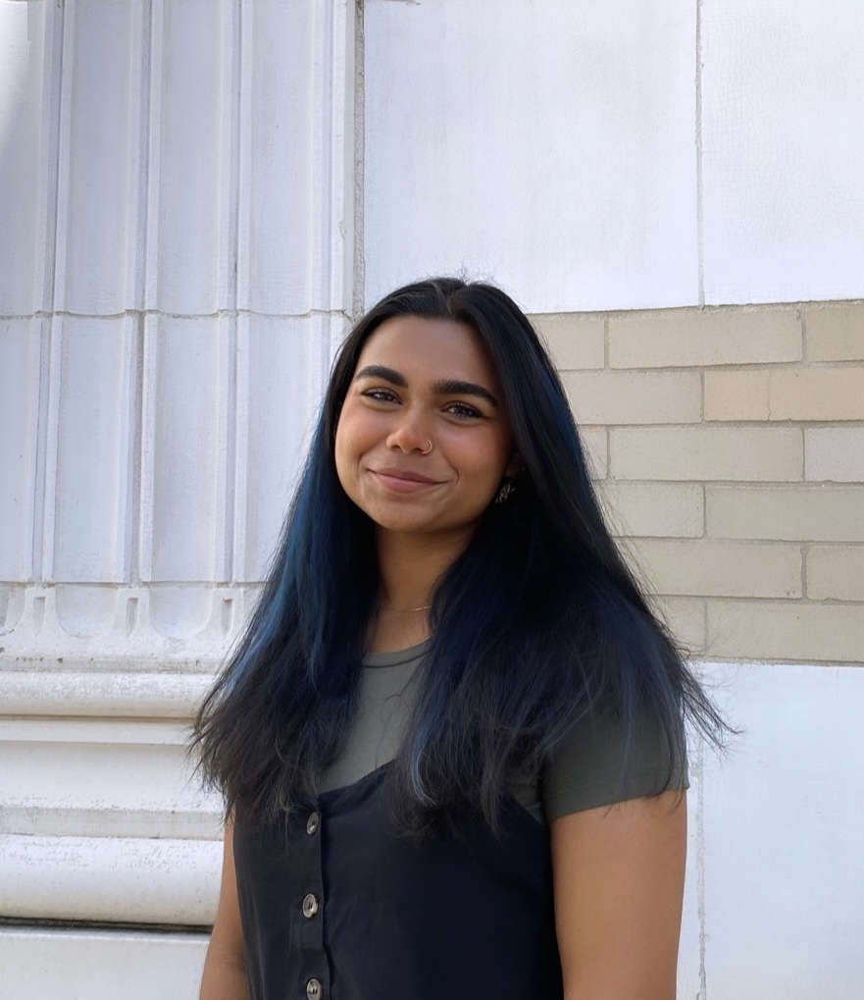

```{=html}
<style>

/* ---------- REMOVE EXTRA QUARTO PAGE SPACING ---------- */

main.content {
  padding-bottom: 0 !important;
}

#quarto-content,
#quarto-document-content {
  padding-bottom: 0 !important;
  margin-bottom: 0 !important;
}

body {
  margin-bottom: 0 !important;
}

/* ---------- HOMEPAGE ---------- */

.homepage-main {
  min-height: auto;
  padding: 2rem 6vw 0rem 6vw;
  box-sizing: border-box;

  display: flex;
  justify-content: center;
  align-items: flex-start;
}

/* This keeps the image + bio centered together as one unit */
.intro-section {
  display: grid;
  grid-template-columns: auto minmax(520px, 850px);
  align-items: center;
  justify-content: center;
  justify-items: center;

  gap: 4rem;
  width: 100%;
  max-width: 1300px;
  margin: -0.75rem auto 0 auto;
}

/* ---------- HEADSHOT ---------- */

.headshot-frame {
  width: clamp(260px, 30vw, 390px);
  height: clamp(260px, 30vw, 390px);
  border-radius: 50%;
  overflow: hidden;
  background: ##B7FF91;

  display: flex;
  align-items: center;
  justify-content: center;
  border: 14px solid #B7FF91;
  box-shadow: 18px 18px 0 #D85CDB;
}

.headshot-frame img {
  width: 100%;
  height: 100%;
  object-fit: cover;
}

/* ---------- BIO TEXT ---------- */

.bio-text {
  max-width: 850px;
  font-size: clamp(1rem, 1.4vw, 1.7rem);
  line-height: 1.18;
  letter-spacing: -0.025em;
  font-family: "Inter", Arial, sans-serif;
  text-align: center;
}

/* ---------- RESPONSIVE ---------- */

@media (max-width: 900px) {
  .homepage-main {
    padding: 1.75rem 1.5rem 0rem 1.5rem;
  }

  .intro-section {
    grid-template-columns: 1fr;
    gap: 2rem;
    max-width: 850px;
    margin-top: -0.5rem;
  }

  .bio-text {
    max-width: 100%;
    font-size: 1.45rem;
  }
}

</style>

<main class="homepage-main">

  <section class="intro-section">

    <div class="headshot-frame">
      
    </div>

    <div class="bio-text">
      Hi! I’m Tasnim, a Statistics graduate from Carnegie Mellon University with a minor in Media Design, currently working as a software engineer. I’m passionate about combining my analytical and design skills to create user-centered, data-driven products.
    </div>

  </section>

</main>
```