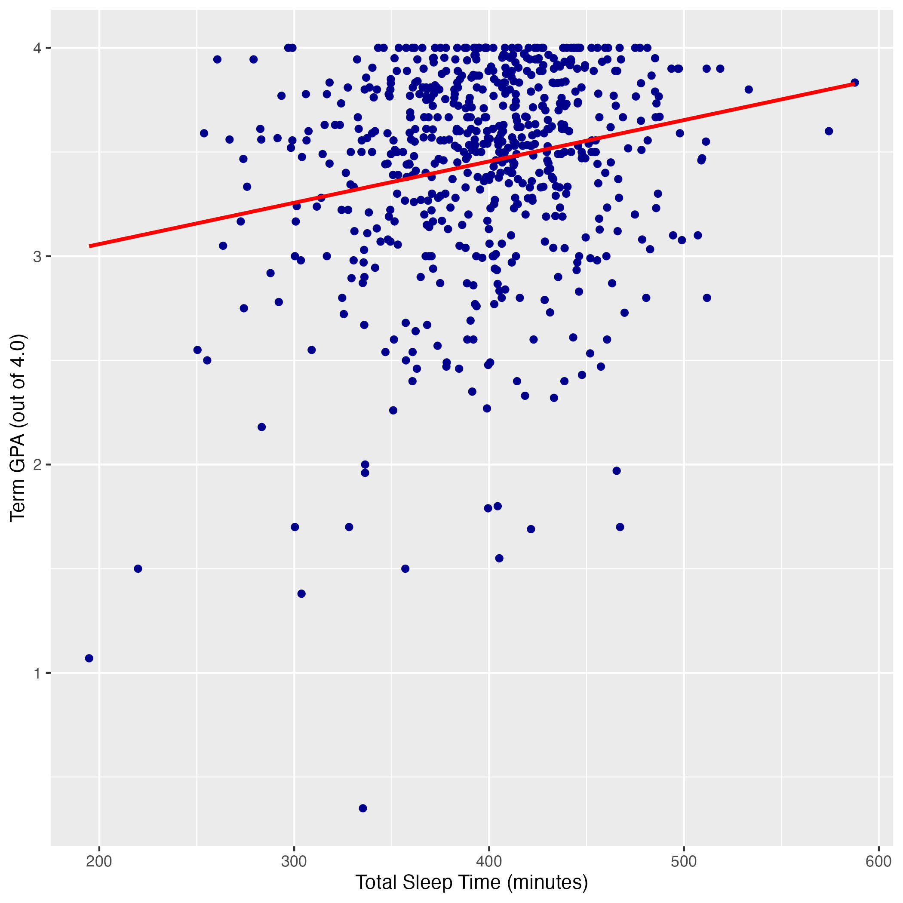
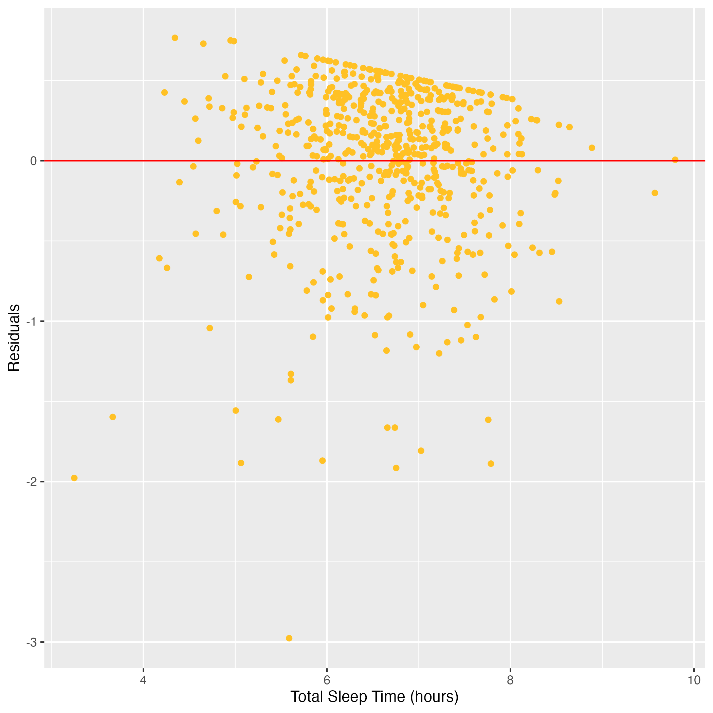

```{=html}
<link rel="stylesheet" href="https://cdn.jsdelivr.net/npm/bootstrap-icons@1.11.3/font/bootstrap-icons.css">
<link href="https://fonts.googleapis.com/css2?family=Fraunces:wght@400;500;600;700&family=Inter:wght@400;500;600;700&display=swap" rel="stylesheet">

<style>

:root {
  --bg: #f4f4f4;
  --black: #111;
  --white: #ffffff;
  --purple: #D85CDB;
  --green: #b7ff91;
  --soft-purple: #F7E8F8;
}

html,
body {
  margin: 0;
  padding: 0;
}

body {
  background: var(--bg);
  overflow-x: hidden;
  color: var(--black);
}

#quarto-content,
#quarto-document-content,
.page-columns,
.content,
main.content {
  width: 100% !important;
  max-width: 100% !important;
  margin: 0 !important;
}

main.content {
  padding: 0 !important;
  padding-bottom: 0 !important;
}

.quarto-title-block {
  display: none !important;
}

/* ---------------- POSTER CANVAS ---------------- */

.poster-page {
  width: min(1250px, calc(100vw - 1rem));
  min-height: auto;
  margin: 1rem auto 0;
  background: var(--bg);
  padding: 3rem 2rem 1rem;
  box-sizing: border-box;
  font-family: "Inter", sans-serif;
  color: var(--black);
}

/* ---------------- HEADER ---------------- */

.poster-header {
  text-align: center;
  max-width: 860px;
  margin: 0 auto 4rem;
}

.poster-header h1 {
  font-family: "Fraunces", serif;
  font-size: clamp(1.8rem, 3vw, 2.45rem);
  line-height: 1.08;
  font-weight: 400;
  margin: 0 0 1rem;
  letter-spacing: 0;
  color: var(--black);
}

.poster-header p {
  font-family: "Inter", sans-serif;
  font-size: 0.95rem;
  line-height: 1.18;
  max-width: 660px;
  margin: 0 auto 0.8rem;
  color: var(--black);
}

.poster-date {
  font-family: "Inter", sans-serif;
  font-size: 0.9rem;
  margin-bottom: 1.6rem;
  color: var(--black);
}

.nav-buttons {
  display: flex;
  justify-content: center;
  gap: 1.2rem;
}

.nav-buttons a {
  font-family: "Inter", sans-serif;
  color: var(--black);
  text-decoration: none;
  font-size: 1.15rem;
  width: 2.8rem;
  height: 2.8rem;

  display: inline-flex;
  align-items: center;
  justify-content: center;

  border: 2px solid var(--black);
  border-radius: 999px;
  background: var(--white);
  box-shadow: 5px 5px 0 var(--green);

  transition: transform 0.18s ease, box-shadow 0.18s ease, background 0.18s ease;
}

.nav-buttons a:hover {
  color: var(--black);
  background: var(--green);
  box-shadow: 5px 5px 0 var(--purple);
  transform: translateY(-2px);
}

.nav-buttons i {
  line-height: 1;
}

/* ---------------- MAIN LAYOUT ---------------- */

.poster-grid {
  display: grid;
  grid-template-columns: 0.92fr 1.08fr;
  column-gap: 3rem;
  row-gap: 4rem;
  align-items: center;
}

.intro-copy {
  align-self: center;
}

.question {
  position: relative;
  font-family: "Fraunces", serif;
  font-size: clamp(1.5rem, 2.55vw, 2.25rem);
  line-height: 1.08;
  font-weight: 400;
  max-width: 560px;
  margin: 0 auto 2.9rem auto;
  text-align: center;
  color: var(--black);
}

/* ---------------- PROJECT-STYLE CARDS ---------------- */

.section-card,
.image-panel {
  background: var(--white);
  border: 2px solid var(--black);
  border-radius: 30px;
  box-sizing: border-box;
  color: var(--black);
}

.section-card {
  position: relative;
  min-height: auto;
  padding: 3.8rem 2rem 2rem;
  box-shadow: 10px 10px 0 var(--green);
}

.section-card.large {
  min-height: auto;
}

.section-tag {
  position: absolute;
  top: -1.45rem;
  left: 50%;
  transform: translateX(-50%);

  background: var(--green);
  border: 2px solid var(--black);
  border-radius: 999px;

  padding: 0.75rem 2rem;

  font-family: "Fraunces", serif;
  font-size: 1.05rem;
  font-weight: 700;
  text-transform: none;
  white-space: nowrap;
  letter-spacing: 0;
  color: var(--black);
}

.section-card p,
.section-card li {
  font-family: "Inter", sans-serif;
  font-size: 1rem;
  line-height: 1.55;
  color: var(--black);
}

.section-card p {
  margin: 0;
}

.section-card p + p {
  margin-top: 1rem;
}

.section-card ul {
  padding-left: 1.2rem;
  margin: 1rem 0 0;
}

.section-card li {
  margin-bottom: 0.65rem;
}

/* ---------------- IMAGE / GRAPH CARDS ---------------- */

.image-panel {
  padding: 1.65rem;
  box-shadow: 10px 10px 0 var(--purple);

  display: flex;
  align-items: center;
  justify-content: center;
}

.image-panel img {
  width: 100%;
  display: block;
  border-radius: 16px;
  object-fit: contain;
}

.map-panel {
  margin-top: 0;
  align-self: center;
  justify-self: center;
  width: 92%;
}

.model-graph-panel {
  width: 100%;
  align-self: stretch;
}

/* ---------------- METHODOLOGY ---------------- */

.methodology-row {
  grid-column: 1 / -1;
  width: 100%;
  display: flex;
  justify-content: center;
}

.methodology-card {
  width: 82%;
  max-width: 920px;
  padding-top: 3.8rem;
  padding-bottom: 2.15rem;
  box-shadow: 10px 10px 0 var(--green);
}

/* ---------------- GRAPH + MODEL RESULTS ROW ---------------- */

.model-row {
  grid-column: 1 / -1;
  width: 90%;
  max-width: 1120px;
  margin: 0 auto;

  display: grid;
  grid-template-columns: 1fr 1fr;
  column-gap: 3rem;
  align-items: stretch;
}

.model-results-card {
  position: relative;
  min-height: auto;
  padding: 3.8rem 2rem 2rem;
  box-shadow: 10px 10px 0 var(--green);
}

.stat-grid {
  display: grid;
  grid-template-columns: repeat(2, 1fr);
  gap: 1.35rem;
  margin-top: 1.65rem;
}

.stat-card {
  background: var(--white);
  border: 2px solid var(--black);
  border-radius: 22px;
  padding: 1.3rem 1.55rem;
  box-sizing: border-box;
}

.stat-number {
  font-family: "Fraunces", serif;
  font-size: clamp(2rem, 4vw, 3.1rem);
  line-height: 1;
  font-weight: 400;
  margin-bottom: 0.7rem;
  color: var(--black);
}

.stat-number.small-stat {
  font-size: clamp(1.55rem, 3vw, 2.35rem);
  white-space: nowrap;
}

.stat-number sup {
  font-size: 0.48em;
  vertical-align: super;
  line-height: 0;
}

.stat-card p {
  font-family: "Inter", sans-serif;
  font-size: 0.92rem;
  line-height: 1.35;
  margin: 0;
  color: var(--black);
}

/* ---------------- KEY FINDINGS ---------------- */

.key-findings-row {
  grid-column: 1 / -1;
  width: 100%;
  display: flex;
  justify-content: center;
  box-sizing: border-box;
}

.key-findings-section {
  width: 82%;
  max-width: 920px;
  margin: 0 auto;
  box-sizing: border-box;
}

.key-findings-heading {
  display: flex;
  align-items: center;
  justify-content: center;
  gap: 1rem;

  margin: 0 auto 2rem auto;

  font-family: "Fraunces", serif;
  font-size: clamp(1.5rem, 2.55vw, 2.25rem);
  font-weight: 400;
  line-height: 1;
  color: var(--black);
}

.key-findings-heading img {
  width: 48px;
  height: 48px;
  object-fit: contain;
  display: block;
}

.key-finding-card {
  display: grid;
  grid-template-columns: 72px 1fr;
  gap: 1.1rem;
  align-items: center;

  width: 100%;
  margin: 0 auto 1.35rem auto;

  background: var(--white);
  border: 2px solid var(--black);
  border-radius: 18px;

  padding: 1.25rem 1.6rem;
  box-sizing: border-box;

  box-shadow: 7px 7px 0 var(--green);

  font-family: "Inter", sans-serif;
  color: var(--black);
}

.key-finding-card:last-child {
  margin-bottom: 0;
}

.key-finding-icon {
  width: 58px;
  height: 58px;
  border-radius: 50%;

  background: #efffe8;

  display: flex;
  align-items: center;
  justify-content: center;
}

.key-finding-icon svg {
  width: 34px;
  height: 34px;
  stroke: var(--black);
  stroke-width: 2.3;
  fill: none;
  stroke-linecap: round;
  stroke-linejoin: round;
}

.key-finding-icon .purple-fill {
  fill: var(--purple);
  stroke: var(--black);
}

.key-finding-label {
  margin: 0 0 0.35rem 0;

  font-family: "Inter", sans-serif;
  font-size: 1rem;
  font-weight: 800;
  line-height: 1.15;
  color: var(--black);

  text-decoration: none;
  pointer-events: none;
}

.key-finding-text p {
  margin: 0;

  font-family: "Inter", sans-serif;
  font-size: 0.86rem;
  line-height: 1.42;
  color: var(--black);
}

/* ---------------- MOBILE ---------------- */

@media (max-width: 760px) {
  .poster-page {
    width: 100%;
    margin: 0;
    padding: 2rem 1rem 1rem;
    min-height: auto;
  }

  .poster-grid,
  .model-row {
    grid-template-columns: 1fr;
    row-gap: 3rem;
  }

  .poster-header {
    margin-bottom: 2.5rem;
  }

  .nav-buttons {
    gap: 0.9rem;
    flex-wrap: wrap;
  }

  .question {
    margin-left: auto;
    margin-right: auto;
    margin-bottom: 2.6rem;
    text-align: center;
    font-size: clamp(1.5rem, 2.55vw, 2.25rem);
    font-weight: 400;
  }

  .map-panel,
  .methodology-card,
  .methodology-row,
  .key-findings-row,
  .key-findings-section,
  .model-row {
    width: 100%;
  }

  .section-card,
  .section-card.large,
  .model-results-card {
    min-height: auto;
  }

  .section-card,
  .model-results-card {
    padding: 3.5rem 1.35rem 1.6rem;
  }

  .image-panel {
    padding: 1rem;
  }

  .stat-grid {
    grid-template-columns: 1fr;
    gap: 1rem;
  }

  .stat-card {
    padding: 1.1rem 1.25rem;
  }

  .key-findings-heading {
    font-size: clamp(1.5rem, 2.55vw, 2.25rem);
    font-weight: 400;
    gap: 0.75rem;
    margin-bottom: 1.75rem;
  }

  .key-findings-heading img {
    width: 24px;
    height: 24px;
  }

  .key-finding-card {
    grid-template-columns: 58px 1fr;
    padding: 1rem;
    gap: 0.9rem;
    box-shadow: 6px 6px 0 var(--green);
    margin-bottom: 1.2rem;
  }

  .key-finding-icon {
    width: 48px;
    height: 48px;
  }

  .key-finding-icon svg {
    width: 29px;
    height: 29px;
  }

  .key-finding-label {
    font-size: 0.95rem;
  }

  .key-finding-text p {
    font-size: 0.8rem;
  }
}

</style>

<div class="poster-page">

  <header class="poster-header">
    <h1>Exploring the Relationship Between Sleep Duration and College GPA</h1>

    <p>
      A statistical analysis examining whether college students’ average sleep duration is associated with semester GPA.
    </p>

    <div class="poster-date">October 2023</div>

    <nav class="nav-buttons">
      <a href="401.pdf" aria-label="Report" title="Report">
        <i class="bi bi-file-earmark-pdf"></i>
      </a>
    </nav>
  </header>

  <main class="poster-grid">

    <section class="intro-copy">
      <div class="question">
        Is there an association between average sleep duration and academic performance among college students?
      </div>

      <div class="section-card">
        <div class="section-tag">Research Overview</div>
        <p>
          This project examines whether college students who sleep less tend to have lower GPAs. The analysis uses data from students at Carnegie Mellon University and two other universities, where students wore sleep trackers for one month during the spring semester.
        </p>
      </div>
    </section>

    <section class="image-panel map-panel">
      
    </section>

    <section class="methodology-row">
      <div class="section-card methodology-card">
        <div class="section-tag">Methodology</div>

        <p>
          A simple linear regression in R was used to evaluate the association between sleep duration and academic performance. Based on exploratory data analysis, the model focused on the relationship between students’ average nightly sleep time and semester GPA.
        </p>

        <ul>
          <li>
            <strong>Simple Linear Regression:</strong> Used to model the association between TotalSleepTime and term_gpa.
          </li>

          <li>
            <strong>Variable Transformation:</strong> Converted TotalSleepTime from minutes to hours by dividing by 60, allowing the slope estimate to be interpreted as the average GPA difference associated with one additional hour of sleep.
          </li>

          <li>
            <strong>Model Evaluation:</strong> The regression plot suggested a plausibly linear relationship, though visible variation around the fitted line indicated that the model may not fully capture all patterns in the data.
          </li>
        </ul>
      </div>
    </section>

    <section class="model-row">

      <div class="image-panel model-graph-panel">
        
      </div>

      <div class="section-card model-results-card">
        <div class="section-tag">Model Results</div>

        <p>
          The fitted model found a positive slope estimate for sleep duration. The p-value was very small, providing evidence that the slope coefficient is not equal to zero.
        </p>

        <div class="stat-grid">
          <div class="stat-card">
            <div class="stat-number">0.1191</div>
            <p>
              Estimated GPA increase associated with one additional hour of sleep.
            </p>
          </div>

          <div class="stat-card">
            <div class="stat-number small-stat">3.04 × 10<sup>−7</sup></div>
            <p>
              P-value for the sleep duration coefficient, indicating statistical significance.
            </p>
          </div>
        </div>
      </div>

    </section>

    <section class="key-findings-row">
      <div class="key-findings-section">

        <div class="key-findings-heading">
          
          <span>Key Findings</span>
          
        </div>

        <div class="key-finding-card">
          <div class="key-finding-icon">
            <svg viewBox="0 0 64 64" aria-hidden="true">
              <path d="M12 52h40"></path>
              <path d="M18 43c4-7 8-12 14-12s10 5 14 12"></path>
              <path d="M18 43c4 4 9 6 14 6s10-2 14-6"></path>
              <circle cx="32" cy="24" r="8"></circle>
              <path class="purple-fill" d="M32 7l2.4 5 5.5.8-4 3.9.9 5.5-4.8-2.6-4.8 2.6.9-5.5-4-3.9 5.5-.8L32 7z"></path>
            </svg>
          </div>

          <div class="key-finding-text">
            <div class="key-finding-label">Positive Association</div>
            <p>
              Students who slept more tended to have higher semester GPAs on average, suggesting a positive relationship between sleep duration and academic performance.
            </p>
          </div>
        </div>

        <div class="key-finding-card">
          <div class="key-finding-icon">
            <svg viewBox="0 0 64 64" aria-hidden="true">
              <path d="M12 52h40"></path>
              <rect x="16" y="39" width="7" height="13"></rect>
              <rect x="29" y="30" width="7" height="22"></rect>
              <rect x="42" y="19" width="7" height="33"></rect>
              <path class="purple-fill" d="M29 9h6v11h9l-12 14-12-14h9z"></path>
            </svg>
          </div>

          <div class="key-finding-text">
            <div class="key-finding-label">Estimated GPA Effect</div>
            <p>
              Each additional hour of sleep was associated with a 0.1191-point increase in GPA. Two fewer hours of sleep corresponded to an estimated 0.2382-point decrease in GPA.
            </p>
          </div>
        </div>

        <div class="key-finding-card">
          <div class="key-finding-icon">
            <svg viewBox="0 0 64 64" aria-hidden="true">
              <path d="M10 52h44"></path>
              <path d="M14 43l10-11 9 7 16-22"></path>
              <circle cx="14" cy="43" r="3.2" class="purple-fill"></circle>
              <circle cx="24" cy="32" r="3.2" class="purple-fill"></circle>
              <circle cx="33" cy="39" r="3.2" class="purple-fill"></circle>
              <circle cx="49" cy="17" r="3.2" class="purple-fill"></circle>
              <path d="M14 16h14"></path>
              <path d="M14 23h20"></path>
              <path d="M14 9h26"></path>
            </svg>
          </div>

          <div class="key-finding-text">
            <div class="key-finding-label">Correlation, Not Causation</div>
            <p>
              The model shows an association between sleep and GPA, but it does not prove that sleeping more directly causes a higher GPA.
            </p>
          </div>
        </div>

      </div>
    </section>

  </main>

</div>
```