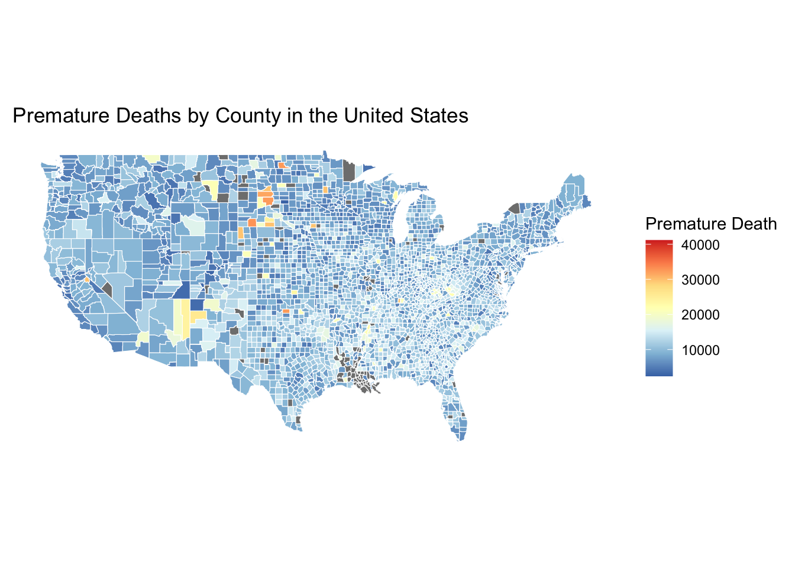
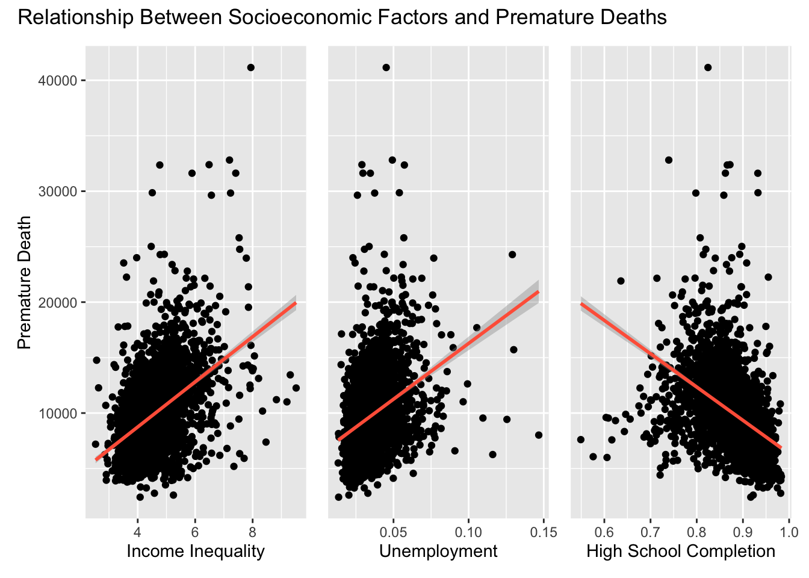
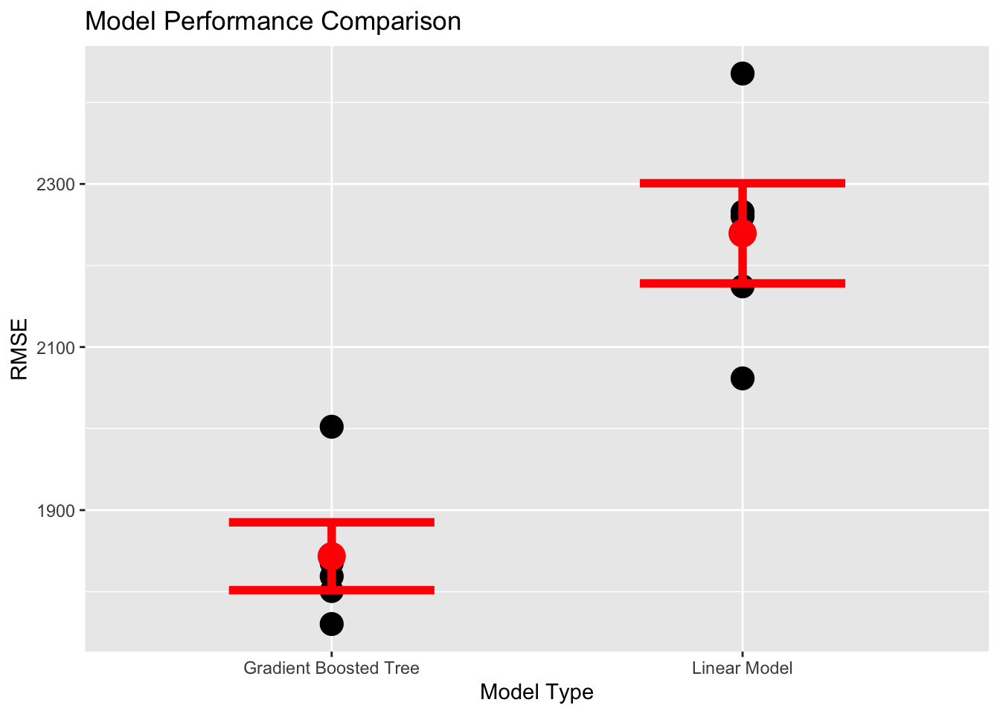

```{=html}
<style>
  /* Hide sidebar image */
  .about-entity img {
    display: none;
  }

  /* Create space on the sides for arrows */
  #capstoneCarousel {
    padding-left: 60px;
    padding-right: 60px;
  }

  /* Style the images with a border */
  .carousel-item img {
    border: 1px solid #dee2e6;
    border-radius: 8px;
  }

  /* Move arrows outside and make them dark */
  .carousel-control-prev, .carousel-control-next {
    width: 50px;
    filter: invert(1); /* Makes white arrows black */
  }

  .carousel-control-prev { left: 0; }
  .carousel-control-next { right: 0; }
</style>

<div id="capstoneCarousel" class="carousel slide" data-bs-ride="carousel" style="max-width: 950px; margin: 20px auto 40px auto;">
  <div class="carousel-inner">
    <div class="carousel-item active">
      
    </div>
    <div class="carousel-item">
      
    </div>
    <div class="carousel-item">
      
    </div>
  </div>

  <button class="carousel-control-prev" type="button" data-bs-target="#capstoneCarousel" data-bs-slide="prev">
    <span class="carousel-control-prev-icon" aria-hidden="true"></span>
  </button>
  <button class="carousel-control-next" type="button" data-bs-target="#capstoneCarousel" data-bs-slide="next">
    <span class="carousel-control-next-icon" aria-hidden="true"></span>
  </button>
</div>
```

# Research Overview
This project examines how socioeconomic factors influence premature death rates across U.S. counties and racial groups. Leveraging data from the County Health Rankings data set, the research quantifies the influence of systemic factors on premature mortality rates at the county level.

# Methodology
The analytical framework employed statistical modeling in R to evaluate relationships between mortality and various Social Determinants of Health (SDOH). Based on exploratory data analysis, 
two distinct modeling approaches were compared:

* Multiple Linear Regression: Utilized to establish baseline correlations and effect sizes.

* Gradient Boosted Trees (XGBoost): Leveraged to capture non-linear relationships and high-dimensional interactions between variables.

# Key Findings
* Socioeconomic Impact: The analysis confirmed that increases in income inequality and unemployment are associated with increases in years of premature death. Conversely, as high school completion percentages increase, premature deaths decrease.
* Variable Importance & Model Divergence: Findings revealed a contrast between the two approaches. The multiple linear regression identified AIAN population percentage as the most important variable, likely due to the model's sensitivity to the small population percentages of this group across the U.S. In contrast, the gradient boosted tree—which proved more reliable with a lower RMSE—identified high school completion as the most significant predictor.

***
*This research was conducted as part of the Carnegie Mellon Summer Undergraduate Research Experience (SURE) program in partnership with UnitedHealth Group.*