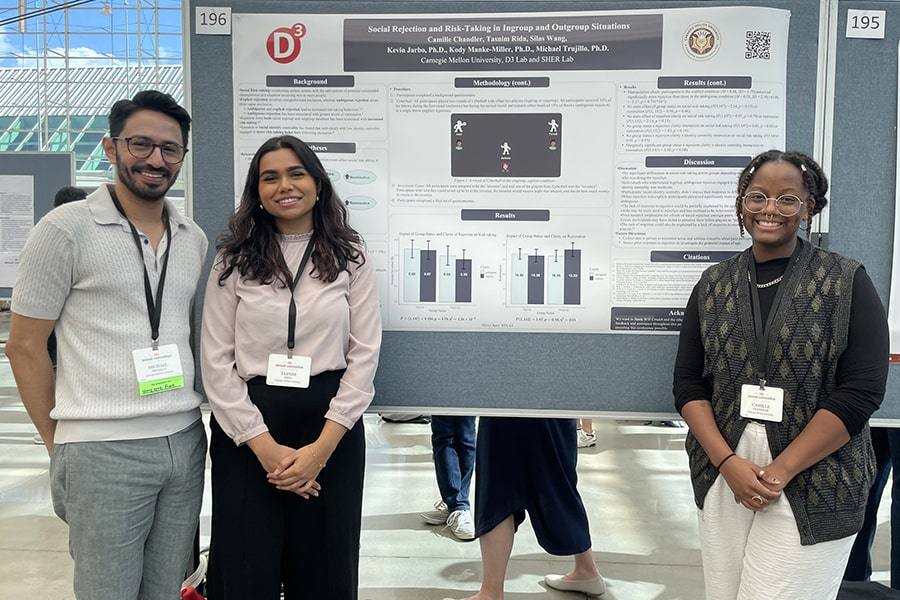
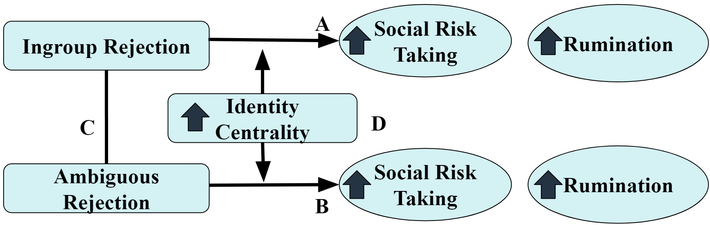
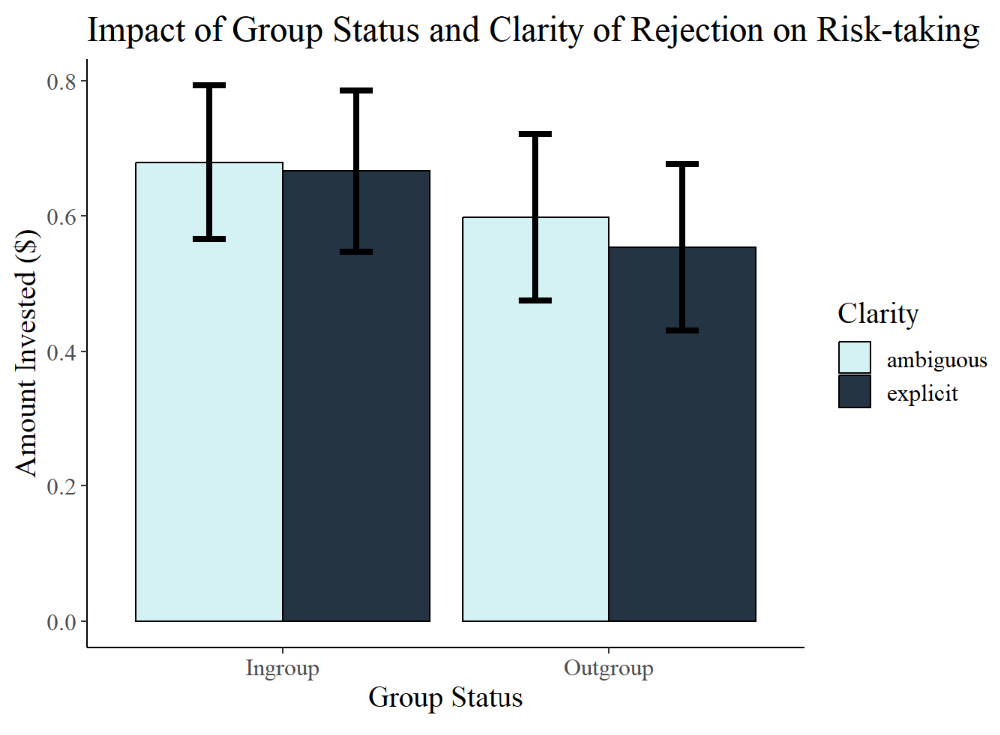
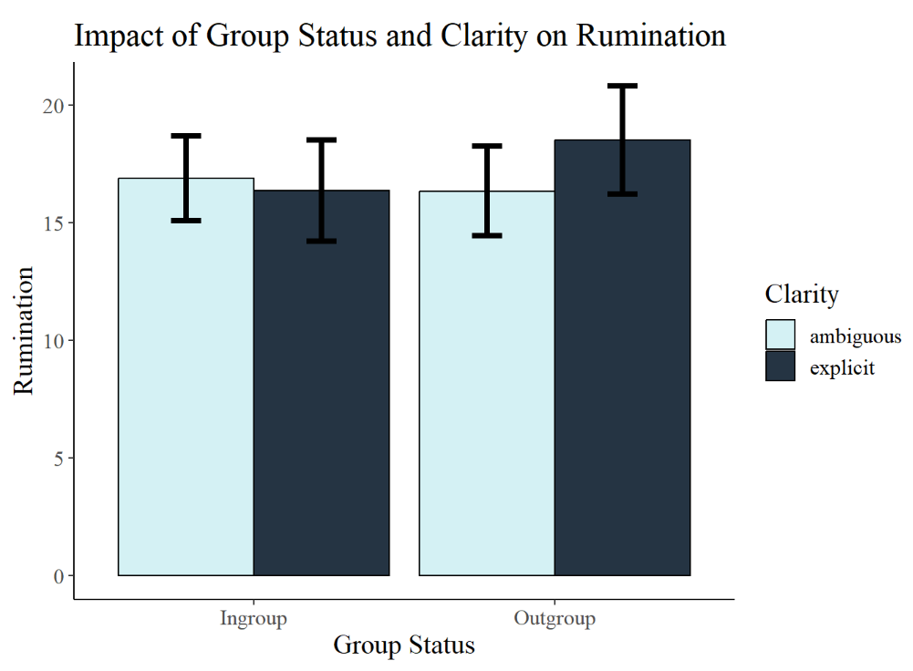

```{=html}
<style>
  /* Hide sidebar image */
  .about-entity img {
    display: none;
  }

  /* Create space on the sides for arrows */
  #sherCarousel {
    padding-left: 60px;
    padding-right: 60px;
  }

  /* Style the images with a border */
  .carousel-item img {
    border: 1px solid #dee2e6;
    border-radius: 8px;
  }

  /* Move arrows outside and make them dark */
  .carousel-control-prev, .carousel-control-next {
    width: 50px;
    filter: invert(1);
  }

  .carousel-control-prev { left: 0; }
  .carousel-control-next { right: 0; }
</style>

<div id="sherCarousel" class="carousel slide" data-bs-ride="carousel" style="max-width: 950px; margin: 20px auto 40px auto;">
  <div class="carousel-inner">
    <div class="carousel-item active">
      
    </div>
    <div class="carousel-item">
      
    </div>
    <div class="carousel-item">
      
    </div>
    <div class="carousel-item">
      
    </div>
  </div>

  <button class="carousel-control-prev" type="button" data-bs-target="#sherCarousel" data-bs-slide="prev">
    <span class="carousel-control-prev-icon" aria-hidden="true"></span>
  </button>
  <button class="carousel-control-next" type="button" data-bs-target="#sherCarousel" data-bs-slide="next">
    <span class="carousel-control-next-icon" aria-hidden="true"></span>
  </button>
</div>
```

# Research Overview

This project investigates how experiences of social rejection influence individuals’ willingness to engage in risk-taking behavior. In particular, it examines how features of social experiences, including rejection clarity (explicit vs. ambiguous) and group membership (ingroup vs. outgroup), shape behavioral responses.

# Methodology

The study employed a 2 (group status: ingroup vs. outgroup) × 2 (rejection clarity: ambiguous vs. explicit) between-subjects experimental design to examine how different in social rejection contexts influence behavior and affect.

Social rejection was manipulated using a modified Cyberball paradigm (online ball-tossing game used to study the psychological effects of social exclusion), with group membership defined by the racial identity of other players. Participants then completed a behavioral task assessing social risk-taking, along with self-report measures capturing emotional and cognitive responses, including rumination, self-esteem, and negative affect.

# Key Findings
* Manipulation Check: The experimental manipulation was successful, with participants in the explicit condition reporting significantly higher perceived rejection than those in the ambiguous condition.

* Rejection Clarity Effects: While rejection clarity strongly shaped participants’ perception of exclusion, it did not translate into significant differences in social risk-taking or rumination. This suggests that subjective experience of rejection may be more sensitive to clarity than behavioral or cognitive responses.

* Group Identity Effects: Rejection from ingroup versus outgroup members did not produce significant differences in social risk-taking or rumination, indicating that group membership alone was not a strong driver of behavioral response in this study.

* Moderator Effect: A marginal effect suggested that individuals with moderate identity centrality may be more psychologically responsive—particularly in terms of rumination—when experiencing ambiguous rejection from ingroup members.

***
*This research was conducted as part of the Dr. Michael Trujillo's Stigma, Health Equity, and Resilience Lab (SHER) Lab at Carnegie Mellon University. Findings were presented at the Society for Personality and Social Psychology 2024 Annual Convention and selected as the winning poster for the Psychology Department at CMU’s Meeting of the Minds 2024.*