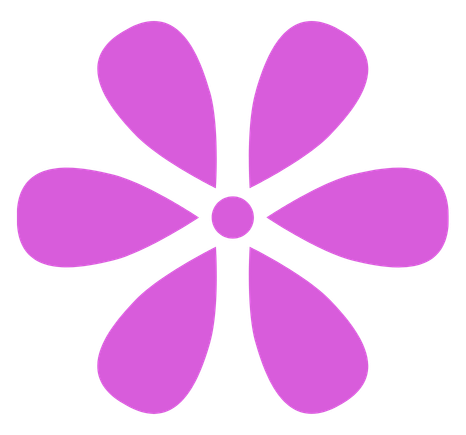
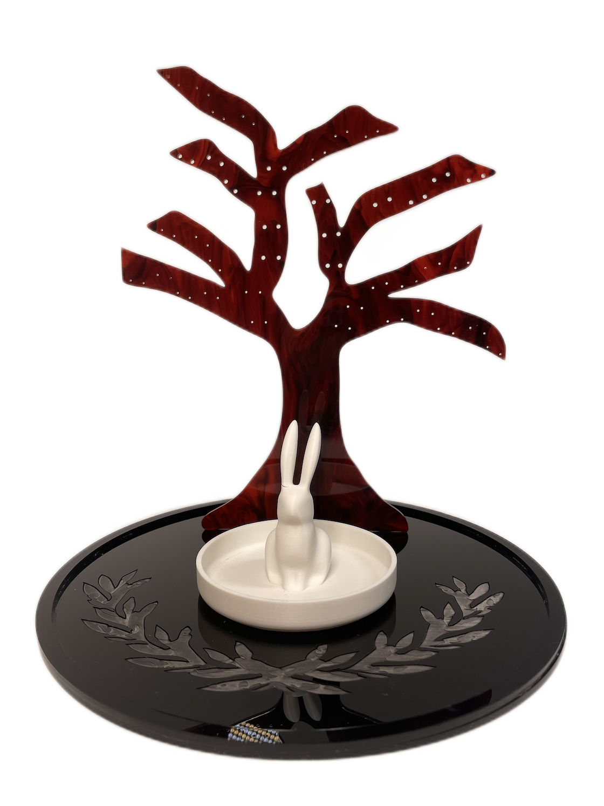
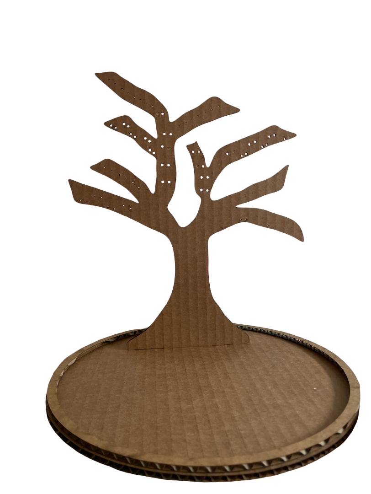
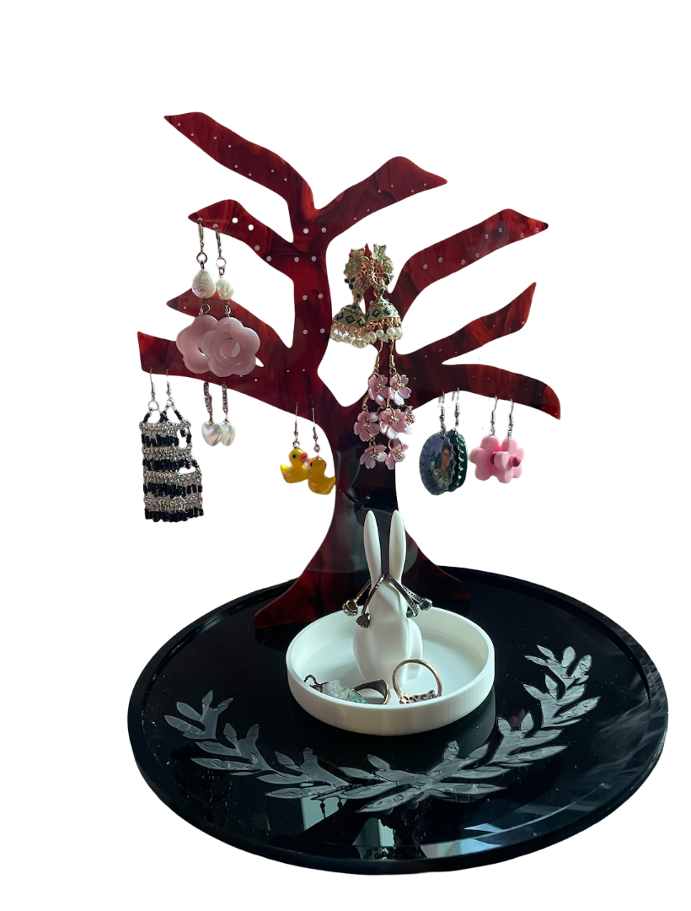

```{=html}
<link rel="stylesheet" href="https://cdn.jsdelivr.net/npm/bootstrap-icons@1.11.3/font/bootstrap-icons.css">
<link href="https://fonts.googleapis.com/css2?family=Fraunces:wght@400;500;600;700&family=Inter:wght@400;500;600;700&display=swap" rel="stylesheet">

<style>

:root {
  --bg: #f4f4f4;
  --black: #111;
  --white: #ffffff;
  --purple: #D85CDB;
  --green: #b7ff91;
  --soft-purple: #F7E8F8;
}

html,
body {
  margin: 0;
  padding: 0;
}

body {
  background: var(--bg);
  overflow-x: hidden;
  color: var(--black);
}

#quarto-content,
#quarto-document-content,
.page-columns,
.content,
main.content {
  width: 100% !important;
  max-width: 100% !important;
  margin: 0 !important;
}

main.content {
  padding: 0 !important;
  padding-bottom: 0 !important;
}

.quarto-title-block {
  display: none !important;
}

/* Hide Quarto heading link icons */
.anchorjs-link,
.header-anchor,
a.anchorjs-link {
  display: none !important;
}

/* ---------------- POSTER CANVAS ---------------- */

.poster-page {
  width: min(1250px, calc(100vw - 1rem));
  min-height: auto;
  margin: 1rem auto 0;
  background: var(--bg);
  padding: 3rem 2rem 1rem;
  box-sizing: border-box;
  font-family: "Inter", sans-serif;
  color: var(--black);
}

/* ---------------- HEADER ---------------- */

.poster-header {
  text-align: center;
  max-width: 860px;
  margin: 0 auto 4rem;
}

.poster-header h1 {
  font-family: "Fraunces", serif;
  font-size: clamp(1.8rem, 3vw, 2.45rem);
  line-height: 1.08;
  font-weight: 400;
  margin: 0 0 1rem;
  letter-spacing: 0;
  color: var(--black);
}

.poster-header p {
  font-family: "Inter", sans-serif;
  font-size: 0.95rem;
  line-height: 1.18;
  max-width: 660px;
  margin: 0 auto 0.8rem;
  color: var(--black);
}

.poster-date {
  font-family: "Inter", sans-serif;
  font-size: 0.9rem;
  margin-bottom: 0;
  color: var(--black);
}

/* ---------------- MAIN LAYOUT ---------------- */

.poster-grid {
  display: grid;
  grid-template-columns: 0.92fr 1.08fr;
  column-gap: 3rem;
  row-gap: 4rem;
  align-items: center;
}

/* ---------------- PROJECT-STYLE CARDS ---------------- */

.section-card,
.image-panel,
.process-card-big {
  background: var(--white);
  border: 2px solid var(--black);
  border-radius: 30px;
  box-sizing: border-box;
  color: var(--black);
}

.section-card {
  position: relative;
  min-height: auto;
  padding: 3.8rem 2rem 2rem;
  box-shadow: 10px 10px 0 var(--green);
}

.section-card.large {
  min-height: auto;
}

.section-tag {
  position: absolute;
  top: -1.45rem;
  left: 50%;
  transform: translateX(-50%);

  background: var(--green);
  border: 2px solid var(--black);
  border-radius: 999px;

  padding: 0.75rem 2rem;

  font-family: "Fraunces", serif;
  font-size: 1.05rem;
  font-weight: 700;
  text-transform: none;
  white-space: nowrap;
  letter-spacing: 0;
  color: var(--black);
}

.section-card p,
.section-card li {
  font-family: "Inter", sans-serif;
  font-size: 1rem;
  line-height: 1.55;
  color: var(--black);
}

.section-card p {
  margin: 0;
}

/* ---------------- FLOWER TEXT DIVIDERS ---------------- */

.flower-divider {
  text-align: center;
  max-width: 100%;
  margin: 0 auto;
  padding: 0 0.5rem;
}

.flower-divider-heading {
  display: flex;
  align-items: center;
  justify-content: center;
  gap: 0.9rem;
  margin-bottom: 0.75rem;
}

.flower-divider-heading img {
  width: 38px;
  height: 38px;
  object-fit: contain;
  display: block;
}

.flower-divider-heading h2 {
  font-family: "Fraunces", serif;
  font-size: clamp(1.45rem, 2.5vw, 2.15rem);
  font-weight: 400;
  line-height: 1;
  margin: 0;
  padding: 0 !important;
  color: var(--black);

  border-bottom: none !important;
  box-shadow: none !important;
  text-decoration: none !important;
  background-image: none !important;
}

.flower-divider p {
  font-family: "Inter", sans-serif;
  font-size: 0.95rem;
  line-height: 1.45;
  max-width: 560px;
  margin: 0 auto;
  color: var(--black);
}

/* ---------------- OVERVIEW + DESIGN GOAL STACK ---------------- */

.overview-stack {
  display: flex;
  flex-direction: column;
  gap: 4.4rem;
  align-self: center;
}

.overview-card {
  padding-bottom: 2rem;
}

/* ---------------- IMAGE CARDS ---------------- */

.image-panel {
  padding: 0.9rem;
  box-shadow: 8px 8px 0 var(--purple);

  display: flex;
  flex-direction: column;
  align-items: center;
  justify-content: center;
}

.image-panel img {
  width: 100%;
  display: block;
  border-radius: 20px;
  object-fit: cover;
}

.hero-panel img,
.in-use-panel img {
  object-fit: contain;
}

.hero-panel {
  margin-top: 0;
  align-self: center;
  justify-self: center;
  width: 78%;
}

.in-use-panel {
  margin-top: 0;
  align-self: center;
  justify-self: center;
  width: 92%;
  overflow: hidden;
}

.in-use-panel img {
  transform: translateX(-3%);
}

/* ---------------- PROCESS SECTION ---------------- */

.process-row {
  grid-column: 1 / -1;
  width: 100%;
  display: flex;
  justify-content: center;
  box-sizing: border-box;
}

.process-section {
  width: 92%;
  max-width: 1120px;
  margin: 0 auto;
  box-sizing: border-box;
}

.process-card-big {
  position: relative;
  padding: 3.8rem 1.5rem 1.8rem;
  box-shadow: 10px 10px 0 var(--green);
}

.process-step-grid {
  display: grid;
  grid-template-columns: repeat(2, minmax(0, 1fr));
  gap: 2rem;
}

.process-step-card {
  background: transparent;
  border: none;
  border-radius: 0;
  box-shadow: none;
  padding: 0;
  box-sizing: border-box;

  display: flex;
  flex-direction: column;
  gap: 0.85rem;
}

.step-media {
  width: 100%;
  border: 2px solid var(--black);
  border-radius: 18px;
  background: var(--soft-purple);
  overflow: hidden;
  box-sizing: border-box;
  box-shadow: 6px 6px 0 var(--purple);
}

.step-media img {
  width: 100%;
  height: 315px;
  object-fit: contain;
  display: block;
  border-radius: 16px;
}

.stl-viewer {
  width: 100%;
  height: 315px;
  background: var(--soft-purple);
  overflow: hidden;
}

.step-text {
  padding: 0.35rem 0.25rem 0;
}

.step-label {
  display: inline-flex;
  align-items: center;
  gap: 0.45rem;

  margin-bottom: 0.45rem;
  padding: 0.38rem 0.75rem;

  border: 2px solid var(--black);
  border-radius: 999px;
  background: var(--green);

  font-family: "Fraunces", serif;
  font-size: 0.95rem;
  font-weight: 700;
  line-height: 1;
  color: var(--black);
}

.step-text h3 {
  font-family: "Fraunces", serif;
  font-size: 1.25rem;
  font-weight: 500;
  line-height: 1.1;
  margin: 0 0 0.45rem;
  color: var(--black);
}

.step-text p {
  font-family: "Inter", sans-serif;
  font-size: 0.92rem;
  line-height: 1.42;
  margin: 0;
  color: var(--black);
}

/* clean timeline strip — no boxes */

.process-strip {
  grid-column: 1 / -1;
  padding: 1.2rem 0.3rem 0.2rem;
  background: transparent;
  border: none;
  box-shadow: none;
}

.process-strip-inner {
  display: grid;
  grid-template-columns: repeat(3, 1fr);
  gap: 0;
  align-items: start;
}

.strip-step {
  position: relative;
  padding: 0.35rem 1.35rem 0;
  background: transparent;
  border: none;
  box-shadow: none;
}

.strip-step:not(:last-child)::after {
  content: "→";
  position: absolute;
  right: -0.25rem;
  top: 0.6rem;

  font-family: "Fraunces", serif;
  font-size: 1.45rem;
  color: var(--black);
}

.strip-step h3 {
  font-family: "Fraunces", serif;
  font-size: 1.08rem;
  font-weight: 500;
  line-height: 1.1;
  margin: 0 0 0.45rem;
  color: var(--black);
}

.strip-step p {
  font-family: "Inter", sans-serif;
  font-size: 0.86rem;
  line-height: 1.38;
  margin: 0;
  color: var(--black);
}

/* ---------------- FINAL + REFLECTION SECTION ---------------- */

.final-stack {
  display: flex;
  flex-direction: column;
  gap: 3.6rem;
  align-self: center;
}

.reflection-text {
  max-width: 620px;
}

/* ---------------- MOBILE ---------------- */

@media (max-width: 760px) {
  .poster-page {
    width: 100%;
    margin: 0;
    padding: 2rem 1rem 1rem;
    min-height: auto;
  }

  .poster-grid,
  .process-step-grid,
  .process-strip-inner {
    grid-template-columns: 1fr;
    row-gap: 3rem;
  }

  .poster-header {
    margin-bottom: 2.5rem;
  }

  .hero-panel,
  .in-use-panel,
  .process-section {
    width: 100%;
  }

  .overview-stack,
  .final-stack {
    gap: 3.2rem;
  }

  .section-card,
  .section-card.large {
    min-height: auto;
  }

  .section-card {
    padding: 3.5rem 1.35rem 1.6rem;
  }

  .image-panel {
    padding: 0.75rem;
  }

  .flower-divider {
    margin-top: 0;
  }

  .flower-divider-heading {
    gap: 0.65rem;
  }

  .flower-divider-heading img {
    width: 28px;
    height: 28px;
  }

  .flower-divider-heading h2 {
    font-size: clamp(1.45rem, 8vw, 2rem);
  }

  .process-card-big {
    padding: 3.5rem 1rem 1rem;
  }

  .step-media img,
  .stl-viewer {
    height: 310px;
  }

  .strip-step {
    padding: 0;
  }

  .strip-step:not(:last-child)::after {
    content: "";
  }

  .process-strip {
    padding-top: 0.4rem;
  }

  .process-strip-inner {
    gap: 1.2rem;
  }

  .in-use-panel img {
    transform: translateX(0);
  }
}

</style>

<div class="poster-page">

  <header class="poster-header">
    <h1>Trinket Tree!</h1>

    <p>
      A digitally fabricated jewelry holder designed to organize earrings while functioning as a decorative object.
    </p>

    <div class="poster-date">December 2024</div>
  </header>

  <main class="poster-grid">

    <div class="overview-stack">

      <section class="section-card overview-card">
        <div class="section-tag">Project Overview</div>

        <p>
          For my DigiTool final project, I designed and fabricated an earring holder inspired by a stylized tree form. The branches create space for hanging earrings, while the circular base and rabbit dish provide a place for rings and smaller jewelry.
        </p>
      </section>

      <section class="flower-divider">
        <div class="flower-divider-heading">
          
          <h2>Design Goal</h2>
          
        </div>

        <p>
          Design a display where lots of bulky jewelry can stay visible and easy to access, making it more likely to be used than jewelry stored away in boxes.
        </p>
      </section>

    </div>

    <section class="image-panel hero-panel">
      
    </section>

    <section class="process-row">
      <div class="process-section">

        <div class="process-card-big">
          <div class="section-tag">Making Process</div>

          <div class="process-step-grid">

            <div class="process-step-card">
              <div class="step-media">
                <div id="stl-viewer" class="stl-viewer"></div>
              </div>

              <div class="step-text">
                <div class="step-label">01</div>
                <h3>Draw + Model</h3>
                <p>
                  I started by drawing the tree outline, then recreated and refined the full design in Fusion 360.
                </p>
              </div>
            </div>

            <div class="process-step-card">
              <div class="step-media">
                
              </div>

              <div class="step-text">
                <div class="step-label">02</div>
                <h3>Cardboard Prototype</h3>
                <p>
                  Using the Fusion 360 model, I laser cut a cardboard version first to test the shape, scale, and structure.
                </p>
              </div>
            </div>

            <div class="process-strip">
              <div class="process-strip-inner">

                <div class="strip-step">
                  <div class="step-label">03</div>
                  <h3>Laser Cut + Engrave</h3>
                  <p>
                    After testing the prototype, I laser cut the final tree and base and engraved the base.
                  </p>
                </div>

                <div class="strip-step">
                  <div class="step-label">04</div>
                  <h3>3D Print</h3>
                  <p>
                    I 3D printed the rabbit ring holder from Thingiverse, an open-source 3D design repository.
                  </p>
                </div>

                <div class="strip-step">
                  <div class="step-label">05</div>
                  <h3>Assemble</h3>
                  <p>
                    I combined the laser-cut tree, engraved base, and printed rabbit holder into the final object.
                  </p>
                </div>

              </div>
            </div>

          </div>
        </div>

      </div>
    </section>

    <section class="image-panel in-use-panel">
      
    </section>

    <div class="final-stack">

      <section class="section-card large">
        <div class="section-tag">Final Use</div>
        <p>
          The finished piece holds earrings across the tree branches, with the holes allowing different earring styles to hang at varying heights. The rabbit dish adds a second jewelry-storage area while giving the object a more personal and whimsical identity.
        </p>
      </section>

      <section class="flower-divider reflection-text">
        <div class="flower-divider-heading">
          
          <h2>Reflection</h2>
          
        </div>

        <p>
          This project helped me think through the relationship between digital design, physical fabrication, and everyday use. Small choices like hole placement, branch spacing, material thickness, and scale directly affected whether the object worked well once fabricated.
        </p>
      </section>

    </div>

  </main>

</div>

<script type="importmap">
{
  "imports": {
    "three": "https://cdn.jsdelivr.net/npm/three@0.160.0/build/three.module.js",
    "three/addons/": "https://cdn.jsdelivr.net/npm/three@0.160.0/examples/jsm/"
  }
}
</script>

<script type="module">
  import * as THREE from "three";
  import { STLLoader } from "three/addons/loaders/STLLoader.js";
  import { OrbitControls } from "three/addons/controls/OrbitControls.js";

  const container = document.getElementById("stl-viewer");

  if (container) {
    const scene = new THREE.Scene();
    scene.background = new THREE.Color(0xF7E8F8);

    const camera = new THREE.PerspectiveCamera(
      45,
      container.clientWidth / container.clientHeight,
      0.1,
      1000
    );

    const renderer = new THREE.WebGLRenderer({ antialias: true });
    renderer.setSize(container.clientWidth, container.clientHeight);
    renderer.setPixelRatio(window.devicePixelRatio);
    container.appendChild(renderer.domElement);

    const ambientLight = new THREE.AmbientLight(0xffffff, 1.6);
    scene.add(ambientLight);

    const directionalLight = new THREE.DirectionalLight(0xffffff, 1.4);
    directionalLight.position.set(4, 5, 6);
    scene.add(directionalLight);

    const controls = new OrbitControls(camera, renderer.domElement);
    controls.enableDamping = true;
    controls.autoRotate = true;
    controls.autoRotateSpeed = 1.3;

    const loader = new STLLoader();

    loader.load(
      "final%20project%20v0.stl",
      function (geometry) {
        geometry.computeVertexNormals();
        geometry.computeBoundingBox();

        const material = new THREE.MeshStandardMaterial({
          color: 0xD85CDB,
          roughness: 0.45,
          metalness: 0.05
        });

        const mesh = new THREE.Mesh(geometry, material);

        const boundingBox = geometry.boundingBox;
        const center = new THREE.Vector3();
        boundingBox.getCenter(center);
        mesh.geometry.translate(-center.x, -center.y, -center.z);

        const size = new THREE.Vector3();
        boundingBox.getSize(size);
        const maxDim = Math.max(size.x, size.y, size.z);
        const scale = 5 / maxDim;
        mesh.scale.set(scale, scale, scale);

        mesh.rotation.x = -Math.PI / 2;

        scene.add(mesh);

        camera.position.set(0, 2.3, 7);
        controls.target.set(0, 0, 0);
        controls.update();

        animate();
      },
      undefined,
      function (error) {
        container.innerHTML =
          "<p style='font-family: Inter, sans-serif; padding: 1rem;'>The STL viewer could not load. Make sure the file is named exactly <strong>final project v0.stl</strong> and is in the same folder as this page.</p>";
        console.error(error);
      }
    );

    function animate() {
      requestAnimationFrame(animate);
      controls.update();
      renderer.render(scene, camera);
    }

    window.addEventListener("resize", function () {
      camera.aspect = container.clientWidth / container.clientHeight;
      camera.updateProjectionMatrix();
      renderer.setSize(container.clientWidth, container.clientHeight);
    });
  }
</script>
```